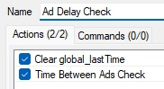
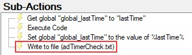
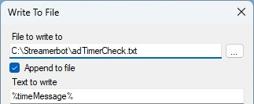
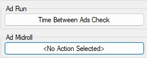

# Ad Warning Checker

## Table of Contents

- [Setup Instructions](#setup-instructions)
- [Actions](#actions)
    - [Time Between Ads Check](#time-between-ads-check)
    - [Clear global_lastTime](#clear-globallasttime)

## Setup Instructions

1. Copy the import string from the [Import File](AdDelayImport.txt)
2. Click the Import button on Streamer.bot
3. Select which actions and commands to import\
   
4. In the **Actions** tab, go to the `Time Between Ads Check` Action and open the `Write to file` sub-action\
   
5. Pick a file into which to output the captured time\
   
6. Alternatively, replace the `Write to file` sub-action with any other you'd like. (e.g. Send a message, play a sound, etc.)
7. Go to Platforms > Twitch > Event > General tab and add the `Time Between Ads Check` action as an Ad Run trigger or Ad Midroll trigger.\
   

## Actions

### Time Between Ads Check

### Clear global_lastTime